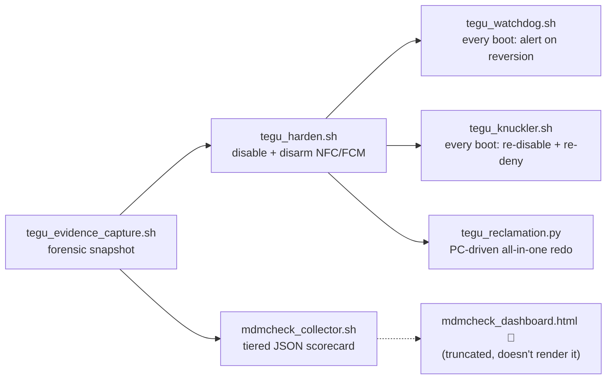

# scripts

### USE AT YOUR OWN RISK (;

Personal tooling, organized by what it's *for* rather than what language it's written in. Most of this exists because a Pixel 9a showed up with enterprise MDM infrastructure nobody asked for, a Motorola got locked out by a test device-owner profile, and things spiraled from there.

**Status legend** — every script was actually syntax-checked (`py_compile`/`pyflakes`, `bash -n`, `node --check`) and read end to end, not just skimmed:

| | Meaning |
|---|---|
| 🟢 | Runs as intended. Still read its must-knows — plenty need a real device, a cloud account, or an API key to do anything. |
| 🟡 | Runs, but has a real caveat you should read before you trust it — a security-relevant default, an exposed bind address, something like that. |
| 🔴 | Doesn't run as committed. The entry says exactly why. |

Two bugs found during this pass were small, mechanical, and obviously unintentional (a missing import, a Python-version-gated syntax error) — those got fixed in place. Two others turned out to be much bigger (large chunks of two files are simply missing) and were left alone rather than guessed-and-filled; those are marked 🔴 with the specifics.

---

## 📱 Project Tegu — de-MDM'ing a Pixel 9a

A Pixel 9a came out of the box with an enterprise MDM stack pre-loaded — CloudDPC, OOBConfig, a CBRS location monitor, an OMA-DM carrier trigger, RepairMode as a priority-999 device admin — none of it opted into. This collection is the full arc: prove what's there, disable what can be disabled without unlocking the bootloader, keep it disabled across OTA updates, and (attempted, see below) visualize the result.

| Status | Script | Platform | Role | What it does |
|---|---|---|---|---|
| 🟢 | `detect_hidden_root.sh` | Android, on-device via `adb shell` | Recon | Checks for `su` binaries, inspects Zygote's maps/environ/cmdline, greps for MDM-flavored system services, checks if `/system` is writable and whether ADB root is enabled. Read-only. |
| 🟢 | `enrollment_evidence_quick.sh` | Host, drives phone via `adb` | Recon | One-shot dump of device-policy, account, and eSIM enrollment state into a timestamped `~/evidence_*.txt`. |
| 🟢 | `enrollment_evidence_deep.py` | Host, drives phone via `adb` | Recon | 14-phase enrollment evidence collector that recursively "chases" any package name, URL, token, or email it finds in one dump into further dumps — it self-expands its own scope. Writes evidence only, never touches device state. |
| 🟢 | `repairmode_evidence_adb.py` | Host, drives phone via `adb` | Recon | Same recursive-chase design, 18 phases: adds bootloader/verified-boot state, FRP partition dump, RepairMode APK internals, and a "what survives repair-mode exit" probe. |
| 🟢 | `repairmode_evidence_termux.py` | On-device, Termux + `rish` (Shizuku) | Recon | The same 18-phase collector, run directly on the phone via `rish` instead of over `adb` from a second machine. |
| 🟢 | `tegu_evidence_capture.sh` | Either — auto-detects Termux vs. ADB host | Recon | Purpose-built pre-hardening snapshot: device identity, enrollment/MDM package states, NFC, ADB trust, CA stores, product-partition APK hashes (the immutable baseline you diff future state against), and a reminder to start a PCAPdroid capture before rebooting. Emits one JSON manifest. |
| 🟢 | `mdmcheck_collector.sh` | Either — auto-detects Termux vs. ADB host | Recon / Score | Runs a 5-tier check battery (activation gates → surface integrity → carrier layer → package fingerprint drift → behavioral) against known baselines for this specific device, and scores the result CLEAN / ELEVATED / COMPROMISED. Designed to be piped straight into a webhook (`\| curl -X POST .../ingest`). |
| 🟢 | `tegu_harden.sh` | Either — auto-detects Termux vs. ADB host | Harden | *(was `Tegu_harden.py` — shell script, not Python; renamed to match)*. Run after evidence capture: disables OOBConfig/RepairMode/RetailDemo, clears CloudDPC's and OOBConfig's FCM tokens (cuts the remote-push enrollment channel), revokes `enterprise.google.com` domain-link handling (disarms the NFC tap-to-enroll vector), turns off the NFC radio, and revokes CloudDPC's runtime permissions. Documents exactly what it *can't* fix without a bootloader unlock (APKs baked into `/product`, SLSI RIL hooks, RKPD). |
| 🟢 | `tegu_reclamation.py` | Host, drives phone via `adb` | Harden (PC-driven) | A heavier, PC-side all-in-one: captures a baseline (package/service/network counts), disables the documented package list, denies a curated set of AppOps, runs a full network-transparency audit (DNS, routes, active TCP, telemetry-domain reachability pings), verifies every change landed, and generates both an audit JSON and a RethinkDNS-importable blocklist. |
| 🟢 | `tegu_watchdog.sh` | On-device, Termux:Boot | Monitor | Runs on every boot. Checks for CloudDPC claiming the HOME launcher (the actual lockdown trip-wire), a Device Owner appearing, and previously-disabled packages (CBRS, OOBConfig, RepairMode) or NFC coming back — any of which means an OTA silently reversed the hardening. Fires a Termux notification on any hit. |
| 🟢 | `tegu_knuckler.sh` | On-device, Termux:Boot | Monitor (aggressive) | *(was `tegu_knuckler.py` — also a shell script mislabeled `.py`; renamed)*. Runs on every boot and re-applies the hardening in 8 rounds: `pm disable-user`, `pm suspend` (catches OOBConfig, which resists plain disable), `am force-stop`, AppOps denials, `device_config` flag flips, `settings put` overrides, and a dedicated watchdog for one specific package (`com.codespaceapps.listeningapp`) that appeared unexplained after a certain date — force-stops it, disables it, and revokes every sensitive runtime permission it holds if it's ever present. |
| 🔴 | `mdmcheck_dashboard.html` | Browser, static file (`file://` works, no server needed) | Dashboard | *(was `Index.html`)*. Meant to be the visual front end for `mdmcheck_collector.sh`'s JSON — it isn't. The script literally cuts off mid template-literal inside a `<script>` block (no closing tag, no `</body>`, no `</html>`); the whole inline script is one syntax error, so **zero JavaScript in the page ever runs**, including the `goApp()`/`goLogin()` handlers every button calls. What *is* present and complete (landing page shell, 14-module sidebar, a real live-`fetch()` passive-scan probe hitting ~46 real MDM/EDR vendor endpoints) never becomes reachable. It also doesn't share any field names with the collector's `mdmcheck_v1` JSON schema — they were never wired together even conceptually. Left as-is rather than guessing at ~600 missing lines of app logic. |

**Must-knows:** `tegu_watchdog.sh` and `tegu_knuckler.sh` both need the **Termux:Boot** app installed and opened once, plus copying the script into `~/.termux/boot/`, or they simply never run. `tegu_harden.sh` refuses to proceed if it detects CloudDPC already holding HOME (i.e. the device is already locked) — that's intentional, not a bug. Everything in this collection is explicit that OTA updates can silently re-enable `SYSTEM_FIXED`/persistent packages, which is the entire reason the watchdog/knuckler pair exists.

---

## 📱 Android / ADB — general utilities

Not MDM-specific, just general device maintenance.

| Status | Script | Platform | What it does |
|---|---|---|---|
| 🟢 | `adb_cache_purge.sh` | Host, drives phone via `adb` | Measures per-app cache via `du`, supports `--dry-run`/`--force`, escalates `pm trim-caches` → `adb root` → `su`-based cleanup (each gated by an actual capability check, not blind execution), then verifies bytes actually freed. |
| 🟢 | `lan_sigint_scanner.py` | On-device, Termux (Pydroid3 works degraded) | Flask web UI (`localhost:8747`) for LAN asset discovery: TCP/ICMP sweep, ARP, full mDNS with TXT/SRV parsing (real model names, not guesses), SSDP, optional WiFi RSSI + Bluetooth. Runs a real functional preflight per Termux capability instead of just checking `which`, and tells you exactly which permission or APK is missing. |

---

## 🔧 Motorola bootloader recovery

Companion pair for a Motorola locked into a managed/kiosk state by a misconfigured TestDPC (device owner) with a forgotten PIN — same shape as the Tegu evidence pair above, one script per execution environment. Both document the same "four hard truths": a device owner can't be removed by `dpm`/`pm`, only by a factory reset triggered from recovery/bootloader (below the OS, bypasses `DISALLOW_FACTORY_RESET`) — that's the `kill-dpc` command and it needs no unlock at all. Everything past that (`unlock`, `flash-stock`, `root`) needs an unlocked bootloader, which needs the OEM-unlock toggle, which a device owner can lock out from the OS side.

| Status | Script | Platform | What it does |
|---|---|---|---|
| 🟢 (fixed) | `moto_recover_termux.py` | Termux on a rootless host Pixel, target over USB-C OTG | *(was `motorola_recover.py`)*. Ships its own fastboot client from scratch: gets a USB file descriptor from `termux-usb -e`, hands it to `libusb_wrap_sys_device()` via ctypes, manually walks the raw USB descriptor for the fastboot class signature, and speaks the fastboot wire protocol directly over `libusb_bulk_transfer` — no root needed on the host. Commands: `detect`, `usb-test`, `kill-dpc` (the reliable fix, needs no unlock), `unlock`, `pull-firmware`, `flash-stock`, `root` (Magisk-patches `init_boot`/`boot.img`). **Was broken:** the `flashing unlock` fallback path (for devices that need that verb instead of `oem unlock`) called `fb.oem("unlock")` again — same verb, no key — because neither of this file's two fastboot classes actually implemented a `flashing()` method at all, unlike its sibling below. Fixed by adding `flashing()` to both classes (mirroring their existing `oem()` methods) and wiring the worker-process dispatcher and the call site to use it. |
| 🟢 | `moto_recover_avf.py` | Android's AVF "Linux Terminal" Debian VM (crosvm/pKVM) — real Debian, not Termux | The VM-side sibling. Its `bridge` command is an honest read-only explainer: the Terminal VM only exposes virtio devices, so a stock unrooted Pixel's fastboot/adb inside the VM sees zero USB devices, full stop — there's no bug to work around, just a wall. So it splits cleanly into PREP (pull-firmware, unzip, parse `flashfile.xml`, Magisk-patch `init_boot`/`boot`) which works today with no device link, and DEVICE commands (`detect`/`kill-dpc`/`unlock`/`flash-stock`/`root`) which need one of the four USB-bridging paths `bridge` documents. |

**Must-knows:** both need a data-carrying USB-C OTG cable and the target already sitting in fastboot/fastbootd — recovery-sideload speaks `adb`, not fastboot, and won't work. `moto_recover_termux.py` additionally needs the **Termux:API app** (not just the `pkg`) installed from F-Droid. Destructive commands (`kill-dpc`, `unlock`, `flash-stock`, `root`) require typing `WIPE` to confirm unless you pass `--yes`. Read-only/safe: `detect`, `usb-test`, `bridge`, `pull-firmware`, prep-only flash steps, and Magisk patching itself (pure file patching, no device touch).

---

## 📦 Web → Android APK packaging

| Status | Script | Platform | What it does |
|---|---|---|---|
| 🟢 (fixed) | `apk_builder.py` | Linux (including on-device Termux on the Pixel itself, or a generic Debian/macOS dev box) | Takes a Cloudflare Worker (`wrangler.toml` + `worker.js`) plus an `index.html` and generates a complete Android Gradle project around them — not a bundler, a code generator: `AndroidManifest.xml`, a `WebView`-wrapper `MainActivity.java`, build files, a wrapper script — then shells out to `gradle`/`./gradlew` to actually build the APK. The generated app serves `index.html`/`worker.js` from `assets/` via `WebViewAssetLoader`; `worker.js` isn't run as a server, it's shimmed to register as a browser Service Worker so it intercepts in-page `fetch()` calls client-side, and `wrangler.toml`'s `vars` are baked in statically (so anything in there ends up compiled straight into the APK — don't put secrets in `vars`). Always debug-signs (auto-generates `~/.android/debug.keystore` if missing), so output is `adb install`-able immediately but not Play-Store-ready. `--install` does exactly that — `adb install -r -d -g` against the first connected device. **Was broken:** `distributionUrl={GRADLE_DIST_URL.replace(":", "\\:")}` put a backslash inside an f-string expression, which is a hard `SyntaxError` on Python below 3.12 (PEP 701 is what makes that legal, and 3.12 wasn't assumed anywhere else in the file) — the script couldn't even parse on stock Debian 12/Ubuntu 22.04 Python. Fixed by precomputing the escaped string before the f-string. |

**Must-knows:** needs JDK 17+ and `ANDROID_HOME`/`ANDROID_SDK_ROOT` set (or it exits cleanly with instructions, unless you pass `--skip-build`). Downloads the Gradle wrapper jar and, if needed, the full Gradle distribution over plain HTTP(S) with **no checksum verification** — both are trusted as fetched. `compileSdk`/`targetSdk` track whatever's the highest SDK platform actually installed locally, not the `TARGET_SDK=35` constant in the file, so behavior can drift from what the code comments claim.

---

## 🎰 Blackjack "provably fair" toolkit

What started as one userscript is now four pieces that work together: read the table, count cards, size bets, and independently verify the casino isn't lying about its "provably fair" shuffle.

| Status | Script | Platform | What it does |
|---|---|---|---|
| 🟢 | `blackjack-advisor.user.js` | Tampermonkey/Violentmonkey userscript, tuned for Firefox for Android | v1.7.0. Glassmorphism overlay: DOM-heuristic table reading (with a pasted-plugin system for site-specific adapters and calibrated canvas pixel-matching), Hi-Lo count, basic strategy + count deviations, Kelly-fraction bet sizing, an accessibility output mode, and a "provably fair" audit panel that talks to the companion server below. Advisory only — never clicks anything or sets bet fields. Domain-gated with a per-hostname confirmation dialog. |
| 🟢 | `blackjack_advisor_ocr.user.js` | Tampermonkey/Violentmonkey userscript | *(was `Bja.js`)*. v6.0.0 — a leaner fork, not a strict upgrade: trades v1.7.0's plugin system, pixel-matching, accessibility output, and audit panel for an OCR fallback (lazy-loads Tesseract.js from a CDN, runs entirely client-side/WASM against a canvas snapshot — the image is never sent anywhere) and a proper in-panel error log with a "copy logs" button. Still strictly advisory-only. `@match` is scoped to the literal placeholder `https://example.com/*`, meaning it's clearly meant to be edited to a real table domain before use, not run as-is. |
| 🟢 | `blackjack-audit-server.js` | Node.js, zero dependencies | Companion to both userscripts, binds `127.0.0.1:9999`. Independently recomputes a casino's committed HMAC-SHA256 + Fisher-Yates shuffle so you're not trusting the casino's own verify page. CORS is wide open by necessity (it can't know the casino's origin in advance) — stop it when you're done auditing. |
| 🟢 | `provably_fair.py` | Cross-platform Python, stdlib only | A CLI companion for the same "provably fair" scheme, independent of a browser: `verify-hash` confirms a revealed server seed actually hashes to the commitment shown before the round, `derive` re-derives the HMAC-SHA256 float stream from seeds/nonce and maps it onto an illustrative card-rank sequence. The rank-mapping is explicitly labeled illustrative — it only means something once you've matched it to the specific casino's published algorithm. |

**Must-know:** `blackjack_advisor_ocr.user.js` declares `readoutEl` far below where it's first used — it only works because `buildPanel()` happens to run after the declaration executes at module-load time; the order is load-bearing even though nothing enforces it.

---

## 🎵 Golden Master Studio — media pipeline

| Status | Script | Platform | What it does |
|---|---|---|---|
| 🔴 | `medtool_web.py` | Termux on the Pixel, or a Debian/Linux box for the heavy lane | *(was `Golden_master_studio.py` — renamed to match what `medtool_setup.sh` actually looks for)*. "Meditation With Attitude": a Flask app that turns a YouTube URL into a finished long-form ambient/meditation video. The pipeline that's actually written and complete: yt-dlp download → optional silence-aware compilation remix → optional Demucs stem separation → a six-preset FX rack (slowed+reverb, chopped & screwed, nightcore, dub, 8D, vaporwave) applied *before* mastering (so loudness analysis measures what actually ships) → two-pass loudnorm mastering with an optional binaural layer → single-encode loop extension (crossfades N copies in one filtergraph — a 3-minute master becomes an 8-hour file with zero generational loss) → audio-reactive video render with a breathing-pacer overlay and whisper word captions → a YouTube thumbnail + metadata pack. All of that is real and self-consistent. **It doesn't run:** the file is truncated mid-`INDEX_HTML` triple-quoted string (`python3 -m py_compile` fails with `unterminated triple-quoted string literal`, confirmed byte-identical to what's tracked in git). Every Flask route, the SSE progress endpoint, the front-end `<script>`, and the final `app.run(...)` call are simply missing from the file — renaming it (done, so `medtool_setup.sh` can at least find it) doesn't make it runnable. |
| 🟢 | `medtool_setup.sh` | Termux, Debian AVF VM, or generic Linux | *(was `setup.sh`)*. The installer for the app above: detects Termux vs. Debian-VM vs. generic Linux and installs the right dependency lane (`ffmpeg`/`yt-dlp`/Flask always; Pillow + faster-whisper unless `--minimal`; torch + Demucs + rubberband under `--heavy`, which it refuses on Termux since torch has no working Termux/aarch64 wheel and tells you to use the Debian VM instead). Every step is optional-aware — a failed component just greys out a feature rather than aborting the install. Ends with a capability summary so you know exactly what you'll get before launching. |

**Must-know:** installing the dependencies with `medtool_setup.sh` will not get you a working app until `medtool_web.py`'s missing back half is restored — running it today fails immediately with the same `SyntaxError` noted above.

---

## 🩺 Personal health dashboard

| Status | Script | Platform | What it does |
|---|---|---|---|
| 🟢 | `prebiosign_health_tracker.html` | Browser, static file, one CDN dependency (Chart.js) | *(was `Prebiosign.html`)*. A fully client-side, `localStorage`-backed health self-monitoring dashboard across six organ systems (cardiac, respiratory, neurological, immune/onc, liver, renal), each with a 4-stage subclinical→severe biomarker progression, red-flag lists, "ask your doctor for this test" scripts, and a dedicated toxicology/emergency-protocols panel (anaphylaxis, heavy metals, QT-prolonging drug interactions, poison control). Trend charting via Chart.js, CSV import/export, guided onboarding tour. Nothing here is live data — it's all hardcoded reference content plus whatever readings you type in yourself; the "LIVE" badge in the header is decorative. |

**Must-know:** the medical content (drug names, doses) reads as confident clinical guidance with no author or sourcing attached — worth remembering it's a personal reference tool, not vetted medical advice. CSV export/import also doesn't quote/escape values, so a biomarker note containing a comma will corrupt the round-trip.

---

## 🕸️ Network, MITM & proxy tooling

| Status | Script | Platform | What it does |
|---|---|---|---|
| 🟢 | `attach_private_network.sh` | Linux/Termux, talks to a modem's AT command port | Watches for any of a list of PLMNs you're authorized to use (private/test networks you operate) over a modem's AT port and attaches to whichever becomes visible first, verifying the modem's actual response at every step and retrying with exponential backoff until registration is confirmed rather than giving up after one failed attempt. Re-execs itself as root via `su -c "$0 $*"` so the whole retry loop runs as one process instead of a fragile quoted `su -c` one-liner. |
| 🟢 | `mitm_diagnose.sh` | Termux, target is your own mitmproxy setup | *(was `Mitm_diag.sh`)*. A pure diagnostic — pinpoints exactly why your own MITM interception setup isn't working, in order: CA cert exists → cert actually in the *system* trust store (Android 7+ ignores user-store-only certs) → mitmproxy process actually running and listening → device proxy setting actually points at it → raw TCP reachability → TLS handshake through the proxy (is the returned cert really the mitmproxy CA?) → TLS handshake direct as a baseline. Ends with a concrete, prioritized fix list, and is upfront that if everything above is green and the target app still won't load, that's certificate pinning inside the app — no CA cert fixes that, you need Frida or an APK patch. |
| 🟢 | `motorola_mitm_proxy.sh` | Rooted Motorola, Termux | *(was `Proxy_moto.sh`)*. Stands up a transparent MITM proxy behind a phone-hosted Wi-Fi hotspot (`cmd wifi start-softap`, default SSID `StealthNet`): generates a CA cert (subject `O=Google Trust Services/CN=GTS CA 1O1`), runs mitmweb in transparent mode behind iptables `REDIRECT` rules, relays and logs DNS-over-TLS (port 853) through a custom Python relay, blocks UDP/443 to force fallback off QUIC, serves a root-free client bootstrap page that opens Android's cert installer, and optionally layers WireGuard plus DuckDNS/No-IP dynamic DNS for remote reach. Proxy and web-UI credentials are randomly generated per run (`openssl rand -base64 12`) and written to a `chmod 600` file. Logs over 10MB get `shred -zu`'d. Controlled via `mitm-ctl {start\|stop\|restart\|status\|panic}`; can auto-start via Termux:Boot. |
| 🟡 | `motorola_mitm_proxy_v2.sh` | Rooted Motorola, Termux | *(was `Proxy_moto_2.sh`)*. Same tool, hardened around the edges: hostapd-based hotspot config as an alternative to the Android softap API, idempotent setup end to end (re-running preserves existing CA/keys/config instead of regenerating), a process-group-aware `mitm-ctl stop`, and — the one clear improvement — log rotation (`mv file file.old`) instead of v1's `shred`. **The one clear regression:** proxy and web-UI passwords are no longer randomly generated — they're hardcoded in the config block as `ChangeMe!23` for both, and nothing in the script forces you to actually change them before it starts serving. Change `PROXY_PASS`/`WEBUI_PASS` before running this one. |
| 🟡 | `netboost_proxy.py` | Cross-platform Python (`pip install requests`) | Despite the name, there's no compression/caching/boosting — `gzip` is imported and never used, and the "compression %" dashboard metric is structurally near-zero for HTML since the proxy's own injected dashboard widget makes pages *larger*, not smaller. What it actually is: a genuine single-user forwarding HTTP/HTTPS proxy with a live latency/byte-count dashboard, an SSRF blocklist for RFC1918/loopback/link-local targets, and a same-origin asset-rewriting layer so proxied pages render correctly. Its own session cookie only ever carries an opaque local token — it never reads or writes cookies on the proxied site. **Read before running:** despite the docstring saying `http://localhost:8080`, it binds `0.0.0.0` — every interface, not just loopback — and the unauthenticated `/sessions` endpoint lists every active session's target URL to anyone who can reach it. Put it behind a firewall or fix the bind address before running it anywhere not fully trusted. |

**A note on the two `motorola_mitm_proxy*.sh` scripts specifically:** these intercept whoever's traffic goes through the hotspot they create, not just the phone's own traffic — treat that hotspot, its CA cert, and its remote-access path (DDNS + WireGuard) the same way you'd treat any interception tooling: only against your own devices/network, with the CA never installed on anything that isn't yours.

---

## ☁️ Cloud provisioning (Oracle Cloud Infrastructure)

| Status | Script | Platform | What it does |
|---|---|---|---|
| 🟢 | `oci_fips_node_launch.sh` | Linux/macOS/WSL, needs `oci` CLI configured | Single chained command: generates an SSH key if missing, resolves compartment/subnet/AD/image OCIDs, launches an ARM `A1.Flex` Always-Free instance with a FIPS-hardened, sysctl-hardened, Docker-ready cloud-init payload. |
| 🟢 | `deploy_ironring_v2.sh` | Linux/macOS/WSL, needs `oci` CLI configured | Multi-instance OCI deploy (n8n+Traefik, plain Ubuntu node, WireGuard netstack box) across dual public/private NSGs. Superseded by v3 — kept for reference. |
| 🟢 | `deploy_ironring_v3.sh` | Linux/macOS/WSL, needs `oci` CLI configured | Full rewrite of v2 into a staged, idempotent reconciler: every resource is lookup-or-create, OCIDs persist to a state file so re-runs skip finished work, a lockfile blocks concurrent runs, and it ends with a real SSH/HTTP/HTTPS/WireGuard verification pass. This is the one to run. |

Both deploy scripts ship with placeholder values (tenancy OCID, domain, email) that must be set via env vars (v3) or in-file edits (v2) before running.

---

## 🔁 Replit → local/GitHub migration

| Status | Script | Platform | What it does |
|---|---|---|---|
| 🟢 | `replit_bloat_cleaner.py` | Cross-platform Python (`requests`, `send2trash`) | Walks a directory for bloat patterns, groups matches, and asks the DeepSeek API to explain each group before an interactive delete/keep prompt. Deletes go through `send2trash` (recoverable). Needs `DEEPSEEK_API_KEY`. |
| 🟢 | `replit_to_github.py` | Cross-platform Python | Strips Replit lock-in files, rewrites hardcoded `*.repl.co`/env-var references, scaffolds missing Android/Node/Python configs, then creates/pushes a GitHub repo via raw `urllib`. Has an optional raw-socket "DNS patch" mode for broken `api.github.com` resolution, off by default. Token-auth push writes the token to a temp-file `GIT_ASKPASS` shim (chmod 700, but touches disk). |
| 🟢 (fixed) | `replit_to_github_hardening_patch.py` | Cross-platform Python | A hardening patch layered on `replit_to_github.py` (imports from it directly — keep both files together): token-free credential-helper push, no `shell=True`, interactive project-root disambiguation, dry-run preview. **Was broken:** its dry-run path called `re.search()` without ever importing `re`, so choosing dry-run crashed with `NameError` every time. Fixed by adding the import. |
| 🟢 | `dns_intrusion_hunter.py` | Cross-platform Python (`requests`, Windows/macOS/Linux process-scan branches) | Resolves a suspicious domain, pulls matching logs from the NextDNS API, greps the filesystem and running processes for references to it, **copies (never deletes)** hits into quarantine, writes a forensic report, and uploads report + quarantine to GitHub. `SUSPICIOUS_DOMAINS` is a placeholder (`malware.example`) — edit before running. |

---

## 💣 Payloads

| Status | Script | Platform | What it does |
|---|---|---|---|
| 🔴 | `duckyscript_payload.txt` | USB Rubber Ducky / Flipper Zero-style BadUSB, targets Windows | DuckyScript keystroke-injection payload: opens a hidden PowerShell, feeds it a base64-encoded one-liner, then `ALT F4`s the window. **Doesn't work as written:** the decoded command builds a `GzipStream` from a base64 blob that decodes to the literal text `Htss//1.0/ Content-Encoding: gviz` — not valid gzip data (wrong magic bytes) — and pipes it through `[IADressUriResolver]::GetCallDomain()`, a type that doesn't exist anywhere in .NET. PowerShell would throw immediately on both the invalid type name and the malformed gzip input; this payload was left exactly as found rather than repaired. |

---

## Non-script files

- `ReplitExport-rljnunez.tar.gz` — a Replit project export bundle (a `Secure-Script-Runner` git repo), the kind of input `replit_to_github.py`/`replit_bloat_cleaner.py` process.
- `privacy-stack.zip` — a self-hosted privacy-stack Docker-Compose kit (Traefik+Authelia, WireGuard, dnscrypt-proxy, Tor, i2p, Portainer) with its own `setup.sh`.
- `LICENSE`

---

## Renamed for consistency

Everything is `snake_case.ext` now (userscripts keep their required `.user.js` suffix; the two blackjack-`-`prefixed files and `detect_hidden_root.sh`/`replit_to_github.py`/`deploy_ironring_v3.sh` were already fine and left alone). If anything — aliases, notes, muscle memory — points at an old name, here's the map:

| Old name | New name |
|---|---|
| `adb-cache-purge.sh` | `adb_cache_purge.sh` |
| `CleanReplitBloat.py` | `replit_bloat_cleaner.py` |
| `Sigint_v2.py` | `lan_sigint_scanner.py` |
| `deploy_ironring.sh` | `deploy_ironring_v2.sh` |
| `grab.sh` | `enrollment_evidence_quick.sh` |
| `grab2.py` | `enrollment_evidence_deep.py` |
| `oci_1liner.sh` | `oci_fips_node_launch.sh` |
| `repair.py` | `repairmode_evidence_adb.py` |
| `replit_shitstorm.py` | `replit_to_github_hardening_patch.py` |
| `right2repair.py` | `repairmode_evidence_termux.py` |
| `volcano_github_uploader.py` | `dns_intrusion_hunter.py` |
| `Duckyscript_payload.txt` | `duckyscript_payload.txt` |
| `Golden_master_studio.py` | `medtool_web.py` |
| `Index.html` | `mdmcheck_dashboard.html` |
| `Mdmcheck_collector.sh` | `mdmcheck_collector.sh` |
| `Mitm_diag.sh` | `mitm_diagnose.sh` |
| `Netboost_proxy.py` | `netboost_proxy.py` |
| `Prebiosign.html` | `prebiosign_health_tracker.html` |
| `Provably_fair.py` | `provably_fair.py` |
| `Proxy_moto.sh` | `motorola_mitm_proxy.sh` |
| `Proxy_moto_2.sh` | `motorola_mitm_proxy_v2.sh` |
| `Tegu_harden.py` | `tegu_harden.sh` |
| `Tegu_watchdog.sh` | `tegu_watchdog.sh` |
| `tegu_knuckler.py` | `tegu_knuckler.sh` |
| `motorola_recover.py` | `moto_recover_termux.py` |
| `Bja.js` | `blackjack_advisor_ocr.user.js` |
| `setup.sh` | `medtool_setup.sh` |
